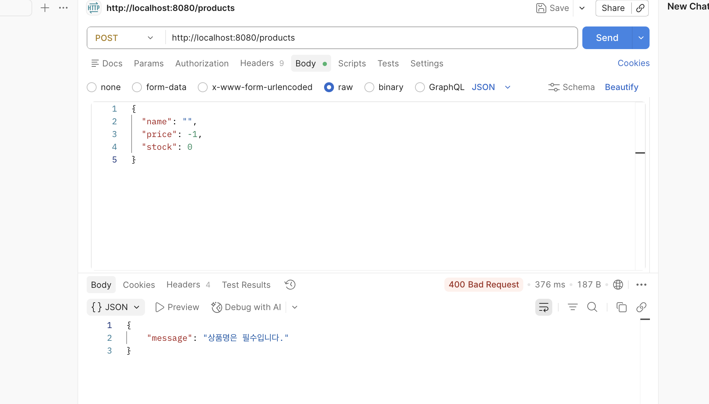
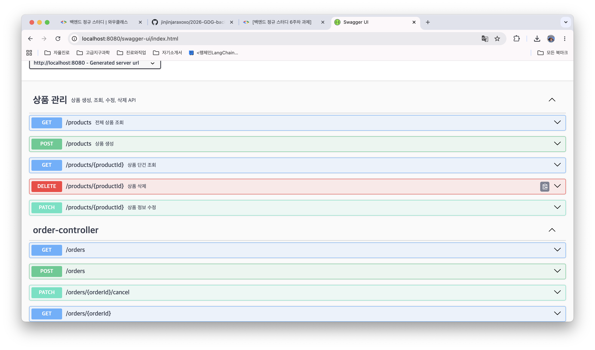

# Week 6 WIL

## 배운 것

### 유효성 검증
- `spring-boot-starter-validation` 의존성을 추가하면 DTO에 `@NotBlank`, `@NotNull`, `@Min` 등의 어노테이션으로 입력값 제약 조건을 명시할 수 있다.
- Controller 메서드 파라미터에 `@Valid`를 붙여야 실제 검증이 동작한다.
- 검증 실패 시 `MethodArgumentNotValidException`이 발생하며, `GlobalExceptionHandler`에서 잡아 400 응답을 반환한다.

### 예외 처리
- `@RestControllerAdvice` + `@ExceptionHandler`를 사용하면 모든 컨트롤러의 예외를 한 곳에서 처리할 수 있다.
- `RuntimeException`을 상속한 커스텀 예외 클래스(`NotFoundException`, `BadRequestException`)를 만들어 의미 있는 예외를 던질 수 있다.
- `NotFoundException` → 404, `BadRequestException` → 400, `Exception` → 500

### API 문서화
- `springdoc-openapi-starter-webmvc-ui` 의존성 추가 후 서버를 실행하면 자동으로 API 문서가 생성된다.
- `http://localhost:8080/swagger-ui/index.html` 에서 Swagger UI 확인 가능
- `@Tag`로 컨트롤러 설명, `@Operation`으로 각 엔드포인트 설명을 추가할 수 있다.

## 스크린샷

### 예외 처리 테스트 (Postman) - 4xx + 에러 메시지 응답

### Swagger UI

